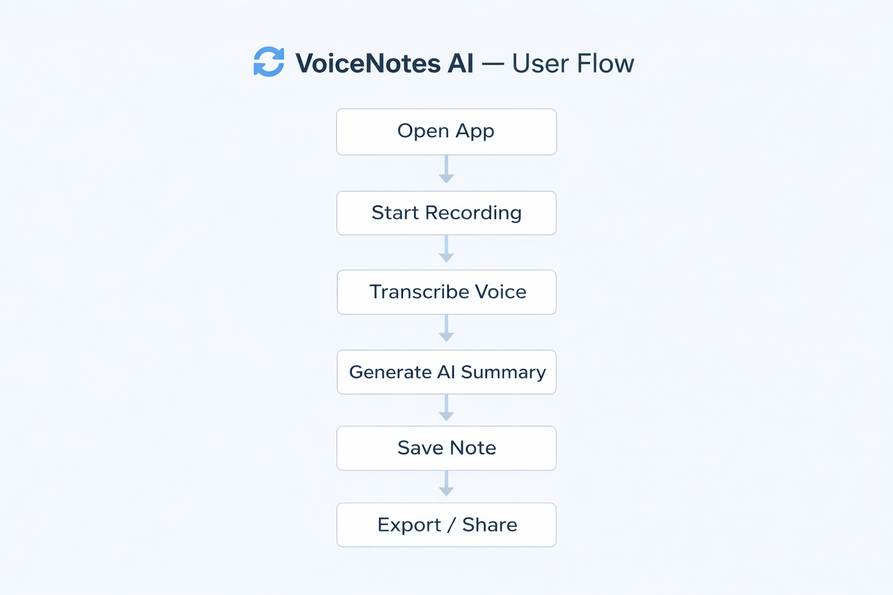

# 🎙️ VoiceNotes AI — Accessibility-Focused Voice Assistant 

An accessibility-focused voice-to-text application that helps users capture, organize, and summarize spoken ideas efficiently.

---

## Overview

VoiceNotes AI is a UI/UX prototype built in Figma that focuses on improving accessibility and productivity through voice-based note-taking and AI-powered summarization.

---

## Problem

Many users struggle to:
- Capture spoken ideas quickly  
- Organize voice notes effectively  
- Extract key insights from long recordings  

---

## Solution

Designed a voice-first application that:
- Converts speech to text in real-time  
- Generates AI-based summaries  
- Organizes notes using keyword tagging
- Enhances productivity through seamless voice interaction and intelligent summarization 

---

## Key Features

- 🎤 Voice-to-text transcription  
- 🧠 AI-generated summaries  
- 🏷️ Smart tagging system  
- 🎨 Accessibility-focused UI  
  - High contrast modes  
  - Scalable typography  
  - Clean visual hierarchy (inspired by Apple HIG)

---

## Design Approach

- Followed **Apple Human Interface Guidelines (HIG)**  
- Focused on:
  - Simplicity  
  - Clarity  
  - Accessibility  
- Designed for inclusive user experience  

---

## Tools Used

- Figma (UI/UX Design & Prototyping)

---

## Screenshots

---

## User Flow

---

## Case Study

👉 [View Detailed Case Study](VoiceNotesAI_CaseStudy.pdf)

---

## Learnings

- Applied design thinking principles  
- Improved skills in UI/UX and accessibility  
- Explored AI integration for productivity tools  

---

## Author

Jagrit Dharewa  
- GitHub: https://github.com/Jagrit3500  
- LinkedIn: https://www.linkedin.com/in/jagrit-dharewa-192ab4353/
